**Отлично! Оба workflow прошли успешно!**

Вижу:
- ✅ **main** ветка — CI тесты прошли (format check, go vet, build)
- ✅ **v0.1.0** тег — релиз создан, бинарники собраны и опубликованы!

---

## 🔹 Шаг 1: Проверь Releases

Открой: https://github.com/kotokhin98-netizen/arduino-manager-gui/releases

Там должен быть **Release v0.1.0** с 3 бинарниками:
- `arduino-manager-linux-x64`
- `arduino-manager-macos-arm64`
- `arduino-manager-windows-x64.exe`

---

## 🔹 Шаг 2: Скачай и запусти Windows бинарник

В PowerShell выполни:

```powershell
cd ~/arduino-manager-gui

Invoke-WebRequest -Uri "https://github.com/kotokhin98-netizen/arduino-manager-gui/releases/download/v0.1.0/arduino-manager-windows-x64.exe" -OutFile "arduino-manager.exe"
.\arduino-manager.exe
```

Должно открыться GUI-приложение Arduino Manager с тёмной темой, боковой панелью, поиском и журналом активности.

---

## 🔹 Шаг 3: Создай README.md

Создай файл `README.md` в корне проекта и вставь этот текст:

```markdown
# Arduino Manager GUI CI/CD Pipeline

Мощный графический менеджер библиотек и ядер для Arduino, написанный на **Go** с использованием GUI-библиотеки **Fyne**. Демонстрирует настройку **пайплайна CI/CD** через GitHub Actions и публикацию кроссплатформенных **бинарников** в GitHub Releases.

## 🚀 О проекте

Arduino Manager GUI предоставляет удобный интерфейс для управления экосистемой Arduino без необходимости использования командной строки:
- 🔍 **Поиск на GitHub**: Поиск библиотек и ядер (cores) непосредственно через GitHub API с фильтрацией по звёздам, автору и сортировке.
- 📦 **Установка из репозиториев**: Клонирование и установка библиотек или ядер из любого GitHub-репозитория (включая выбор конкретных тегов/версий).
- 🗂️ **Локальный индекс**: Работа с официальным индексом библиотек Arduino (скачивание, импорт, установка конкретных версий).
-  **Популярные ядра**: Быстрая установка популярных платформ (ESP8266, ESP32, RP2040, STM32, AVR и др.) в один клик.
- ️ **Гибкая конфигурация**: Автоматическое определение или ручная настройка путей к Sketchbook и Arduino Data Directory.

> ⚠️ **Важно:** Приложение использует **CGO** (для компиляции GLFW и графических библиотек). Поэтому кросс-компиляция "из коробки" невозможна. CI/CD использует **матричную сборку** на 3 разных ОС (Linux, macOS, Windows) с установкой нативных компиляторов.

## 📂 Структура проекта

```text
arduino-manager-gui/
├── .github/workflows/
│   └── ci.yml              # Конфигурация CI/CD (GitHub Actions)
├── Dockerfile.test         # Образ с GUI-зависимостями для Linux
├── main.go                 # Точка входа и вся логика приложения (Go + Fyne)
├── go.mod                  # Go модуль
├── go.sum                  # Контрольные суммы зависимостей
└── .gitignore
```

## 🛠 Локальный запуск

### Вариант 1: Локально (через Docker)
Не требует установки Go и системных GUI-библиотек на хост-машину:

```bash
# 1. Сборка тестового образа с зависимостями
docker build -f Dockerfile.test -t arduino-manager-test .

# 2. Обновление зависимостей
docker run --rm -v "${PWD}:/app" -w /app arduino-manager-test go mod tidy

# 3. Сборка бинарника (Linux)
docker run --rm -e CGO_ENABLED=1 -v "${PWD}:/app" -w /app arduino-manager-test \
  go build -trimpath -ldflags='-s -w' -o arduino-manager-linux-x64 .
```

### Вариант 2: Скачивание готового бинарника
Не требует установки Go или Docker. Скачайте файл из раздела [Releases](https://github.com/kotokhin98-netizen/arduino-manager-gui/releases).

**Windows (PowerShell):**
```powershell
Invoke-WebRequest -Uri "https://github.com/kotokhin98-netizen/arduino-manager-gui/releases/download/v0.1.0/arduino-manager-windows-x64.exe" -OutFile "arduino-manager.exe"
.\arduino-manager.exe
```

**Linux / macOS:**
```bash
# Linux
curl -LO https://github.com/kotokhin98-netizen/arduino-manager-gui/releases/download/v0.1.0/arduino-manager-linux-x64
chmod +x arduino-manager-linux-x64
./arduino-manager-linux-x64

# macOS
curl -LO https://github.com/kotokhin98-netizen/arduino-manager-gui/releases/download/v0.1.0/arduino-manager-macos-arm64
chmod +x arduino-manager-macos-arm64
./arduino-manager-macos-arm64
```
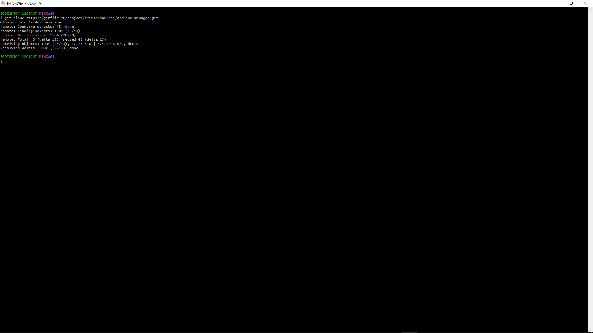
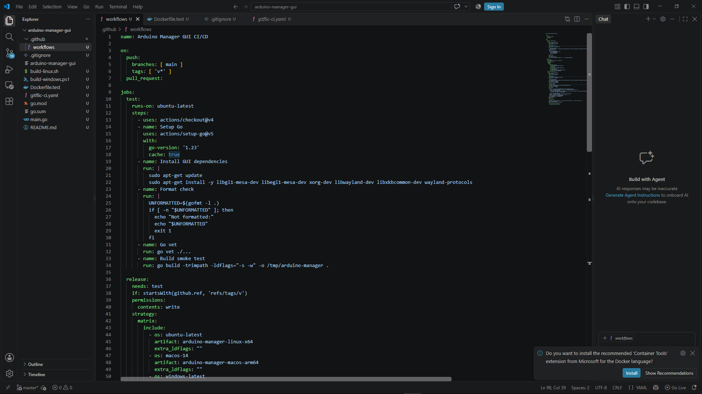
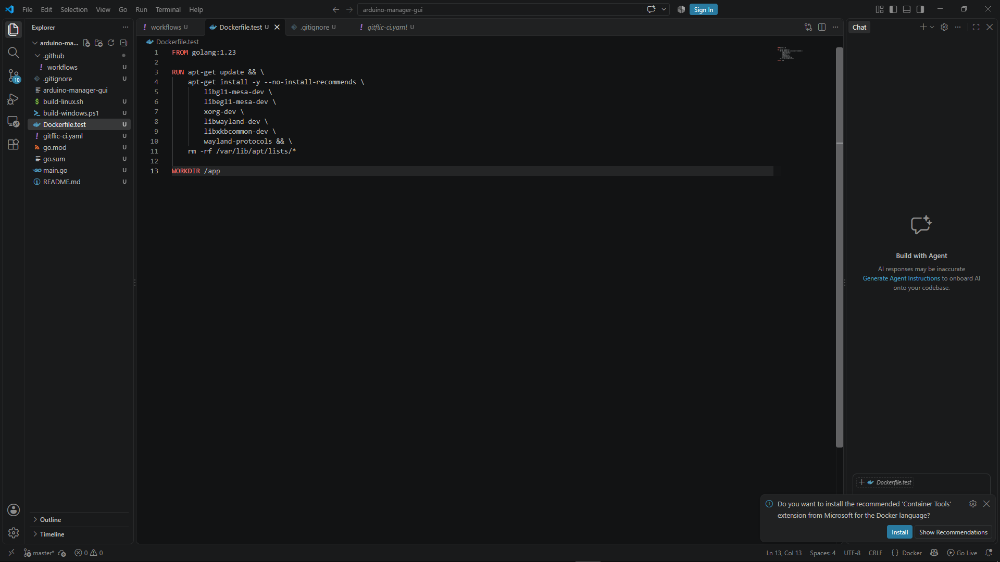
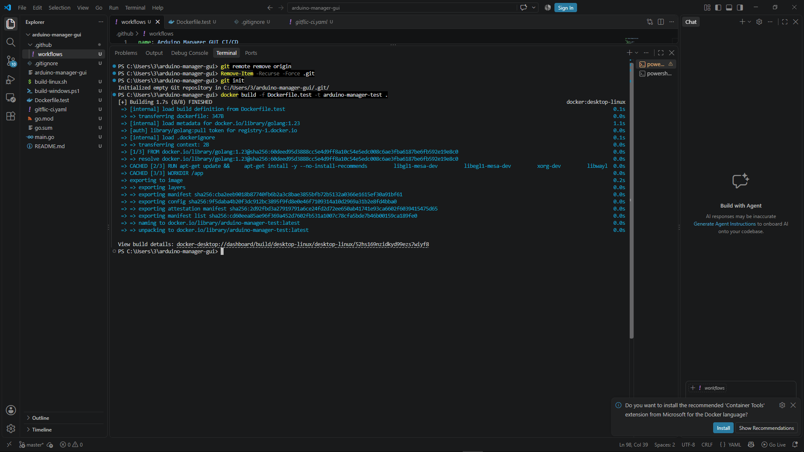
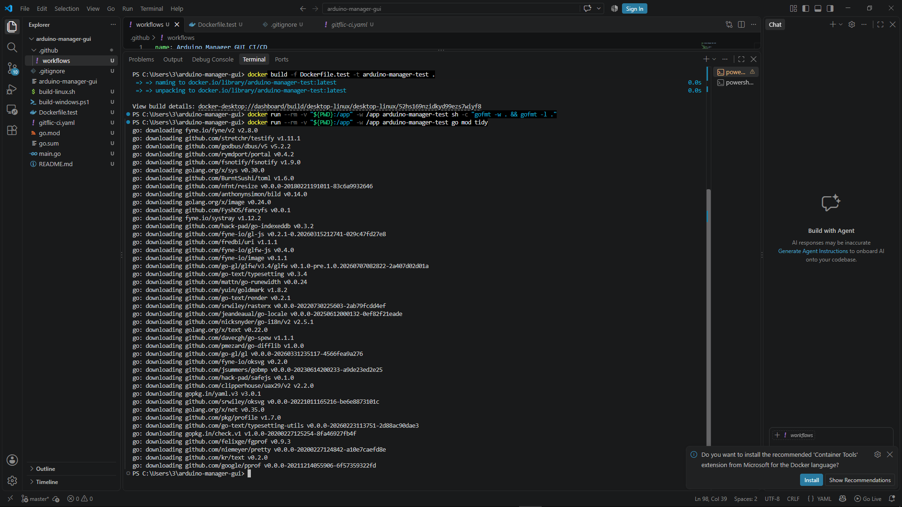
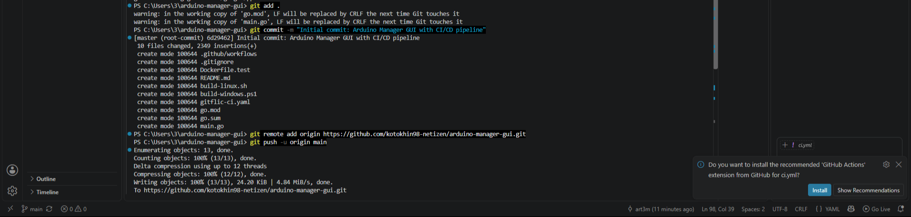

## 🖼️ Возможности интерфейса

*Приложение предоставляет интуитивно понятный интерфейс, разделенный на несколько зон:*
1. **Боковая панель**: Быстрый доступ к поиску библиотек, ядер, локальному индексу и конфигурации.
2. **Панель поиска**: Гибкие фильтры (GitHub API или локальный индекс), сортировка по звёздам/обновлениям.
3. **Список результатов**: Отображение найденных репозиториев с описанием и количеством звёзд.
4. **Панель деталей**: Информация о выбранном элементе и кнопки действий (Установить, Выбрать версию, Удалить).
5. **Журнал активности (Log)**: Пошаговый вывод процесса загрузки, распаковки и установки.

## ⚙️ CI Pipeline (GitHub Actions)

При каждом push в ветку `main` или тег `v*` автоматически выполняется:

| Шаг | Инструмент | Назначение |
|-----|-----------|------------|
| Format check | `gofmt -l` | Проверка форматирования кода |
| Lint | `go vet` | Статический анализ кода |
| Build (smoke) | `go build -trimpath` | Проверка успешности компиляции |
| Matrix Build | CGO + GLFW | Параллельная сборка под Linux, macOS, Windows |
| Release | `softprops/action-gh-release` | Публикация артефактов в GitHub Releases |

### Системные зависимости для сборки

**Linux (Ubuntu/Debian):**
- `libgl1-mesa-dev`, `libegl1-mesa-dev` (OpenGL/EGL)
- `xorg-dev` (X11)
- `libwayland-dev`, `wayland-protocols`, `libxkbcommon-dev` (Wayland)

**Windows:**
- **MSYS2** + MinGW-w64 GCC (устанавливается динамически через `msys2/setup-msys2@v2`)

**macOS:**
- Xcode Command Line Tools (предустановлены на GitHub runners)

## 📦 Публикация в GitHub Releases

Бинарники автоматически публикуются в **GitHub Releases** при создании тега формата `v*`.

**URL релиза:**
```
https://github.com/kotokhin98-netizen/arduino-manager-gui/releases
```

**Доступные платформы:**
- `arduino-manager-linux-x64` (~25-30 MB)
- `arduino-manager-macos-arm64` (~25-30 MB)
- `arduino-manager-windows-x64.exe` (~25-30 MB, без консольного окна благодаря `-H windowsgui`)

## 🔧 Технологии

- **Go 1.23+** — язык программирования
- **Fyne v2** — кроссплатформенная GUI-библиотека на чистом Go
- **CGO / GLFW** — низкоуровневая работа с окнами и графикой
- **GitHub Actions** — автоматизация CI/CD с матричными сборками
- **Docker** — изолированная среда для локальной сборки и тестирования
- **Semantic Versioning** — управление версиями через Git-теги

## 🐛 Troubleshooting

### Ошибка `fatal error: ... .h: No such file or directory` при локальной сборке
**Решение:** Установите недостающие GUI-библиотеки для вашей ОС (см. раздел "Системные зависимости").

### Ошибка `missing go.sum entry`
**Решение:** Выполните `go mod tidy` (или через Docker, как показано выше) и закоммитьте обновлённый файл `go.sum`.

### Приложение не видит установленные платы Arduino
**Решение:** Убедитесь, что в разделе "Configuration" указаны правильные пути к `Sketchbook` и `Arduino Data Directory`. Приложение автоматически пытается определить их, но в нестандартных установках пути могут отличаться.

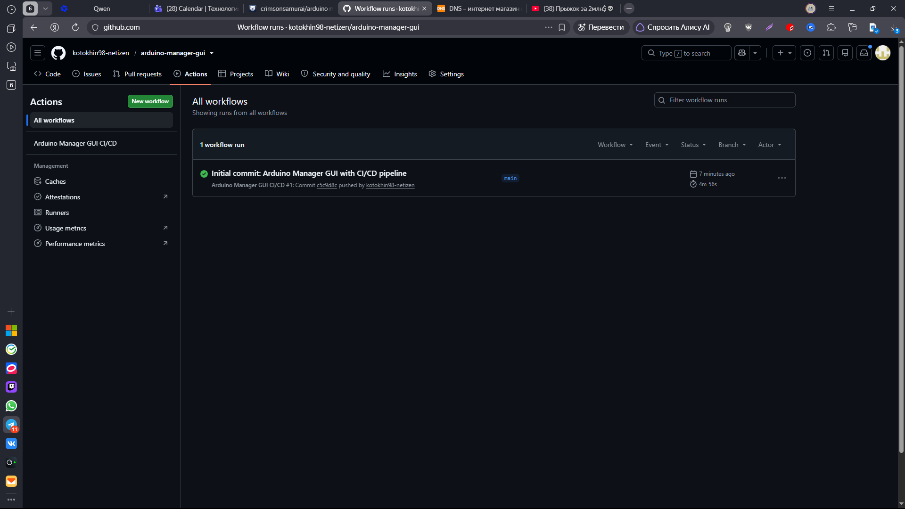
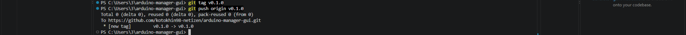
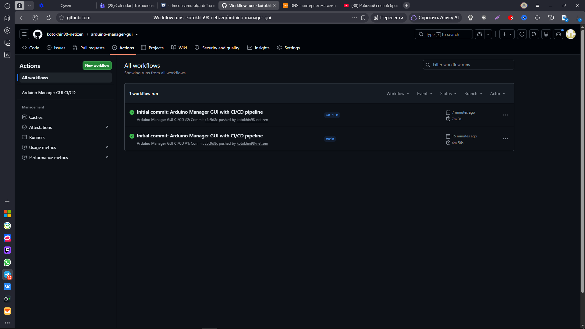
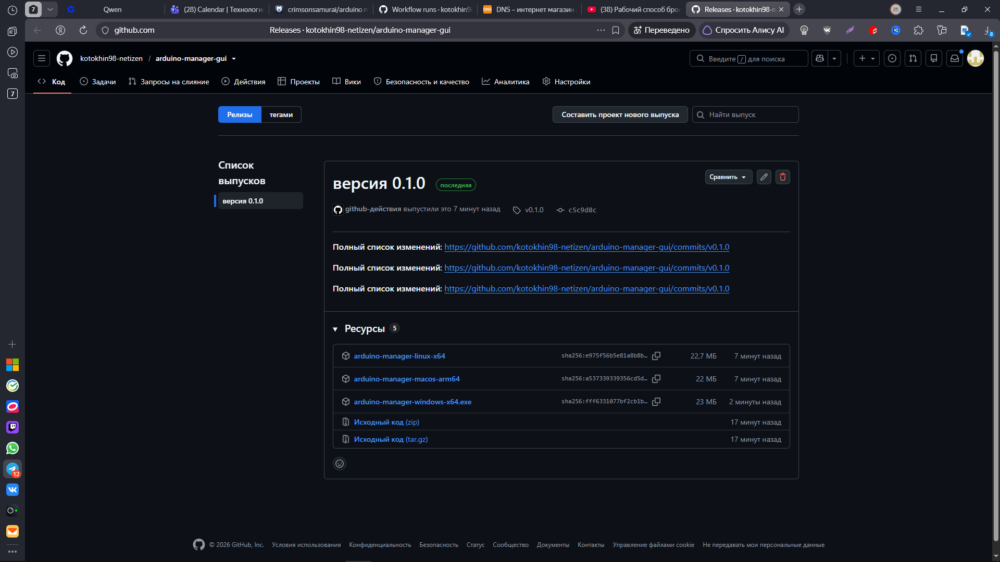
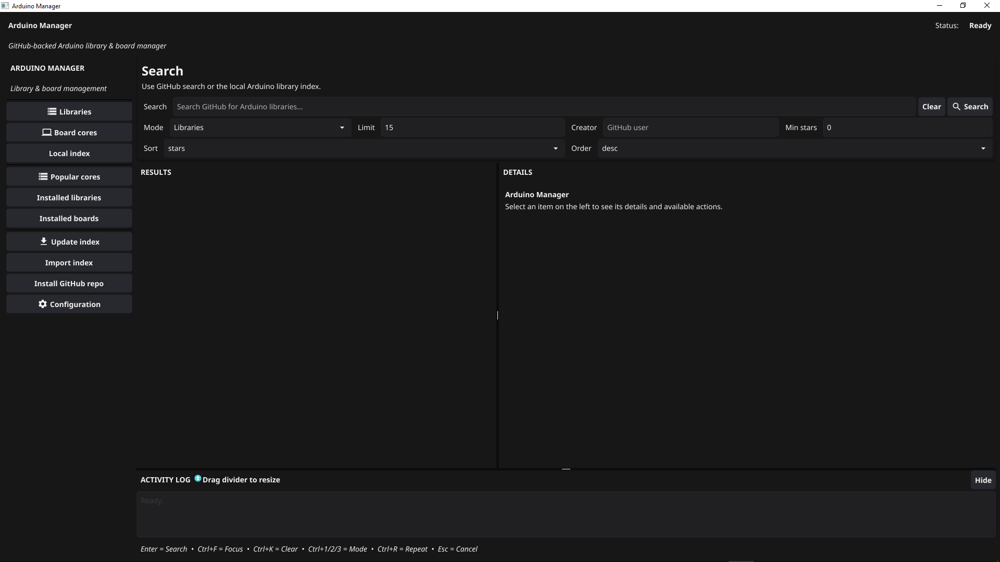
---

**Автор:** [kotokhin98-netizen](https://github.com/kotokhin98-netizen)  
**Оригинальный проект:** [crimsonsamurai/arduino-manager (branch: gui)](https://gitflic.ru/project/crimsonsamurai/arduino-manager?branch=gui)  
**Лицензия:** Распространяется на условиях оригинального репозитория.
```

---

 